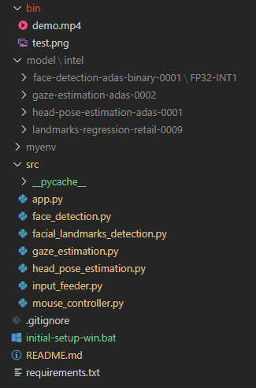

# Computer Pointer Controller

Computer Pointer Controller is a project to control the mouse pointer or cursor by the help of human eyes with the help of deep learning models. It will move the mouse pointer in the direction of gaze. It is optimised and deployed using OpenVino Toolkit. In project there is a pipeline of multiple deep learning model to process input and control the mouse. It take inputs from either a video file or Web Camera.

## Project Set Up and Installation
To setup this project one needs follow these steps:
- Download and install Intel OpenVino Toolkit 2020.1 from [here](https://software.intel.com/content/www/us/en/develop/tools/openvino-toolkit.html)  
- Run the initial-setup-win.bat file in cmd to create and active virtual env, install project specific dependacies, download the required models. Type below command in cmd in project root location
    ```
    initial-setup-win.bat
    ```

### Project Structure


### Project Flow


## Demo
To run demo of this project run the below command in cmd
- Navigate to src folder in project
    ```
    cd src
    ```
- run the project with required arguements
    ```
    python app.py -f "path of face detection model xml file" -l "path of facial landmarks detection model xml file" -hp "path of head pose detection model xml file" -g "path of gaze estimation model xml file" -i "input file path or 'cam' for web camera"
    ```    

    **Example**
    ```
    python app.py -f ..\model\intel\face-detection-adas-binary-0001\FP32-INT1\face-detection-adas-binary-0001.xml -l ..\model\intel\landmarks-regression-retail-0009\FP16\landmarks-regression-retail-0009.xml -hp ..\model\intel\head-pose-estimation-adas-0001\FP16\head-pose-estimation-adas-0001.xml -g ..\model\intel\gaze-estimation-adas-0002\FP16\gaze-estimation-adas-0002.xml -i ..\bin\demo.mp4
    ```

## Documentation
This project accepts following command line arguements:
- `-f` or `--face_detection_model` for path of xml file of face detection model.
- `-l` or `--facial_landmarks_detection_model` for path of xml file of facial landmarks detection model.
- `-hp` or `--head_pose_estimation_model` for path of xml file of head pose estimation model.
- `-g` or `--gaze_estimation_model` for path of xml file of gaze estimation model.
- `-i` or `--input` for path of video file or string “cam” for webcam feed.

## Benchmarks
Model Precision | Model Loading Time | Inference Time
----------| -------------------------| ---------------
INT8 | 3.4841341972351074 | 3.61s 
FP16 | 1.1249244213104248s | 3.65s 
FP32 | 1.2499117851257324s | 3.72s 

**Table: Benchmark result**

## Results
As we can see from the above benchmarks result for different precision model loading time and inference time is reciprocal of each other. When the precision is low loading time is high and inference time is low or we can say model is faster becuase in less precision calculation will be less but model accurancy we also decrease because we need to drop some features. When we increase the model precision, model load time is faster but inference time is high. So we need to choose the precision as per our requirements. Either speed or accurancy.

## Stand Out Suggestions
I have tried to make it working with multiple inputs like video file, image file or even from web camera. Also I tried to solve the multple faces problem in the input.

### Async Inference
I have used async inference because it will not block the entire flow and will not keep the process on hold till we get the result of inference. This boosted the performance and also require less CPU resources, computation power. Hence, will also save power.

### Edge Cases
There will be certain situations that will break your inference flow. For instance, lighting changes or multiple people in the frame. Explain some of the edge cases you encountered in your project and how you solved them to make your project more robust.

- **Multiple Faces:** When there are multiple face in the frame then I have selected the first face of the person so that the program doesn't get confused and we don't get ambiguty error.
- **Low Lighting:** Low lighting will affect the model performance and accurancy. Therefore, one should ensure proper light in the input so that project can work properly.